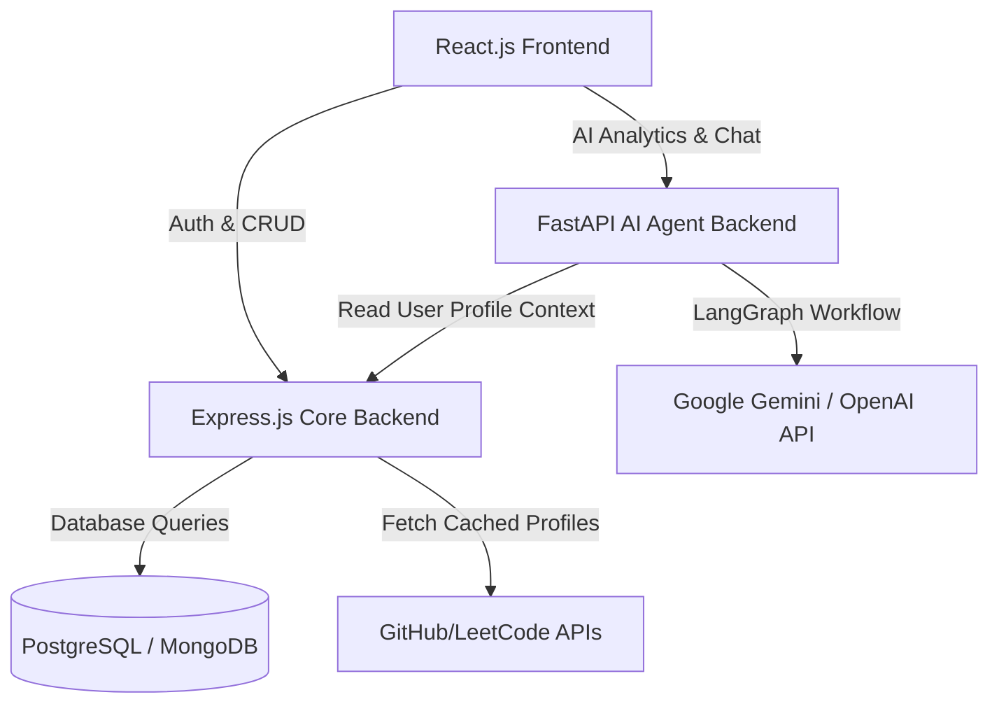
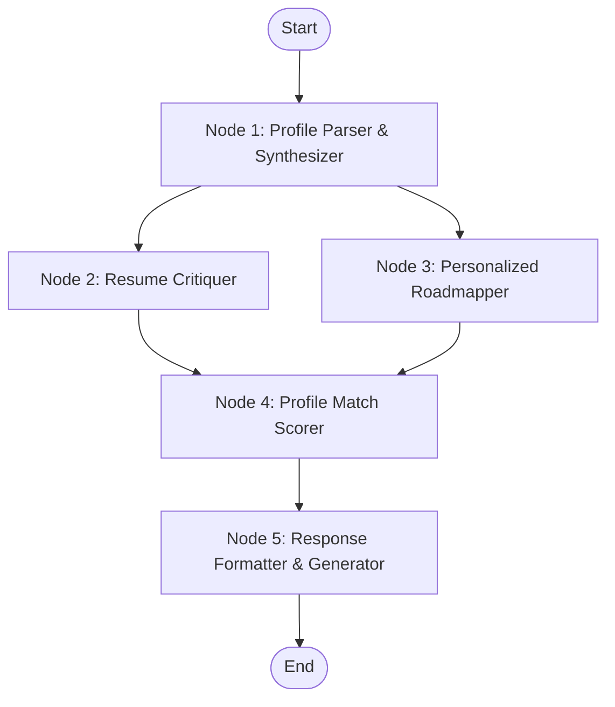

# Product Requirement Document (PRD)
## Project Name: DevPilot (or CarrierBuddy)
**Document Version:** 1.0.0  
**Target Audience:** Engineering Students & Job Seekers  
**Stack:** React.js (Frontend), Express.js (Core Backend), FastAPI + LangGraph + Gemini/OpenAI (AI Agent Backend)

---

## 1. Executive Summary
DevPilot is an AI-powered career preparation and job recommendation platform specifically designed for engineering students. In a competitive job market, candidates need more than just job listings; they need a dynamic, personalized roadmap that bridges the gap between their current skills (derived from GitHub, LeetCode, and resumes) and market demands.

By connecting their coding profiles (GitHub, LeetCode) and uploading their resume, DevPilot evaluates their current technical standing. A specialized AI Agent (built with FastAPI & LangGraph) analyzes this data to:
1. Provide actionable resume critique and optimization feedback.
2. Generate a personalized engineering roadmap targeting skill gaps.
3. Suggest trending engineering topics and resources.
4. Recommend highly relevant jobs aggregated from multiple platforms, scored by profile compatibility.

---

## 2. Problem Statement
* **Information Overload:** Students struggle to identify which skills, frameworks, or system design principles are truly valued in the industry.
* **Static Portfolios:** Resumes are often static and fail to showcase active coding contributions or problem-solving capability.
* **Irrelevant Job Matching:** Job boards recommend listings based on broad keywords rather than actual coding proficiency or technical experience.
* **Lack of Direction:** Students don't know the exact step-by-step roadmap to transition from their current level to their dream role.

---

## 3. Technology Stack & Architecture

DevPilot uses a dual-backend microservices architecture to segregate standard CRUD operations from heavy AI agentic workflows.



### 3.1. Frontend
* **Core:** React.js (Vite)
* **Styling:** Vanilla CSS (custom design system, dark mode, glassmorphism, responsive grid)
* **Routing:** React Router DOM
* **State Management:** React Context API / Zustand
* **Visualizations:** Chart.js / Recharts (for coding stats)

### 3.2. Core Backend (Express.js)
* **Core:** Node.js, Express.js
* **Database ORM:** Prisma
* **Database:** PostgreSQL (Supabase) or MongoDB
* **Authentication:** JWT (JSON Web Tokens) with bcrypt password hashing
* **Features:** Auth routes, profile management, job bookmarking, scraping/fetching cached job data from third-party APIs.

### 3.3. AI Agent Backend (FastAPI)
* **Core:** Python, FastAPI
* **Agent Framework:** LangGraph (for multi-step agentic execution)
* **AI Model:** Google Gemini Flash / OpenAI GPT-4o-mini
* **Features:** Resume parsing/analysis, roadmap generation, hot topics recommender, job compatibility scoring.

---

## 4. Core Features & Functional Requirements

### 4.1. Authentication & Integration Hub
* **User Authentication:** Sign up/Login via Email & Password.
* **Integrations:**
  * **GitHub:** Fetch repo names, main language stack, commit history, and contribution frequency.
  * **LeetCode:** Fetch total solved count, difficulty breakdown (Easy/Medium/Hard), and active badge statistics.
  * **Resume Upload:** Accept PDF/DOCX format, parse text extraction.

### 4.2. LangGraph-Powered AI Career Agent
The AI agent is built using LangGraph to implement a stateful, multi-node reasoning graph.



#### Node-by-Node Specification:
1. **Node 1: Profile Synthesizer:** Aggregates raw text from the parsed resume, GitHub tech stack, and LeetCode scores. Combines them into a standardized JSON schema representing the user's complete technical persona.
2. **Node 2: Resume Critiquer:** Evaluates the resume against modern ATS (Applicant Tracking System) standards. Inspects phrasing, formatting, lack of metrics, and lists direct, bulleted suggestions for improvement.
3. **Node 3: Personalized Roadmapper:** Compares the profile against target roles (e.g., Frontend, Backend, DevOps, AI Engineer). Identifies critical gaps and designs a structured learning plan, including recommended frameworks, databases, and system design topics.
4. **Node 4: Match Scorer (Optional / Async):** Takes a specific job description and returns a compatibility score (0-100%) along with lists of "Matching Skills," "Missing Skills," and "Nice-to-Have Gaps."
5. **Node 5: Response Formatter:** Consolidates the outputs into a clean JSON payload for the React frontend to render dynamically.

### 4.3. Job Aggregator & Match Engine
* **Job Fetching:** Aggregate jobs from mock scraping sources or public APIs (e.g., Adzuna, Jooble, or a pre-populated database).
* **Smart Matching:** Display a percentage-based score (e.g., "85% Match") on each job card. Clicking a card reveals details showing exactly why the candidate matches, what skills are missing, and tips to prepare for it.
* **Job Pipeline:** Let users bookmark jobs and track their status (Saved, Applied, Interviewing, Offered, Rejected).

### 4.4. Additional Value-Added Features (For Hackathon Impact)
* **Cold Email / LinkedIn Message Generator:** Generate custom, tailored outreach messages for a specific job application based on the user's resume highlights and GitHub projects.
* **Trending Engineering Topics Hub:** An interactive feed of hot topics (e.g., "RAG (Retrieval-Augmented Generation)," "WebAssembly," "Rust for Backend") with mini-summaries and suggested learning paths.

---

## 5. Database Schema Design (Prisma / PostgreSQL)

```prisma
datasource db {
  provider = "postgresql"
  url      = env("DATABASE_URL")
}

generator client {
  provider = "prisma-client-js"
}

model User {
  id             String    @id @default(uuid())
  email          String    @unique
  passwordHash   String
  name           String
  createdAt      DateTime  @default(now())
  updatedAt      DateTime  @updatedAt
  profile        Profile?
  applications   JobApplication[]
}

model Profile {
  id               String   @id @default(uuid())
  userId           String   @unique
  user             User     @relation(fields: [userId], references: [id], onDelete: Cascade)
  githubUsername   String?
  leetcodeUsername String?
  resumeUrl        String?
  resumeText       String?  @db.Text
  skills           String[] // Stored as array of skill strings
  targetRole       String?  // e.g. "Full Stack Developer", "Backend Engineer"
  analysisResult   String?  @db.Text // AI Agent cache in JSON string format
  updatedAt        DateTime @updatedAt
}

model Job {
  id           String   @id @default(uuid())
  title        String
  company      String
  location     String
  description  String   @db.Text
  salary       String?
  url          String
  tags         String[]
  createdAt    DateTime @default(now())
}

model JobApplication {
  id        String            @id @default(uuid())
  userId    String
  user      User              @relation(fields: [userId], references: [id], onDelete: Cascade)
  jobTitle  String
  company   String
  status    ApplicationStatus @default(SAVED)
  appliedAt DateTime?
  notes     String?           @db.Text
  updatedAt DateTime          @updatedAt
}

enum ApplicationStatus {
  SAVED
  APPLIED
  INTERVIEWING
  OFFERED
  REJECTED
}
```

---

## 6. API Contracts & Interfaces

### 6.1. Express Backend (Core CRUD & Auth)
* `POST /api/auth/register` — Register a new user.
* `POST /api/auth/login` — Login and receive JWT.
* `GET /api/profile` — Get logged-in user profile, including GitHub & LeetCode details.
* `PUT /api/profile` — Update coding usernames, target roles, or uploaded resume data.
* `GET /api/jobs` — Retrieve aggregated jobs.
* `POST /api/applications` — Save a job application or transition its pipeline status.
* `GET /api/applications` — Retrieve all saved/tracked applications.

### 6.2. FastAPI Backend (AI Agent)
* `POST /api/ai/analyze` — Primary entry point. Takes parsed resume text, GitHub username, LeetCode stats, and target role. Spawns LangGraph runner and returns:
  ```json
  {
    "resume_score": 78,
    "resume_feedback": [
      "Add quantifiable achievements in your weather app project.",
      "List skills in categories rather than a single comma-separated block."
    ],
    "learning_roadmap": [
      {
        "phase": "Phase 1: Core Backend & DB Optimization",
        "topics": ["Indexing in PostgreSQL", "Connection Pooling", "Prisma ORM"],
        "estimated_weeks": 2
      },
      {
        "phase": "Phase 2: System Design fundamentals",
        "topics": ["Caching (Redis)", "Horizontal Scaling", "Load Balancers"],
        "estimated_weeks": 3
      }
    ],
    "trending_suggestions": [
      {
        "topic": "Vector Databases",
        "reason": "Since your projects involve AI agents, learning Pinecone/PGVector will enhance your profile."
      }
    ]
  }
  ```
* `POST /api/ai/match` — Analyzes a specific job description against the synthesized profile. Returns:
  ```json
  {
    "match_score": 85,
    "matching_skills": ["React", "Express.js", "Node.js"],
    "missing_skills": ["Docker", "Redis"],
    "preparation_tips": "Focus on understanding basic Docker containerization commands and Docker Compose, as this job relies heavily on container deployment."
  }
  ```
* `POST /api/ai/cold-email` — Generates custom outreach copy.
  ```json
  {
    "email_subject": "Application for [Job Title] - [User Name]",
    "email_body": "Dear hiring manager, I noticed your opening... Given my recent project [Project Name] involving [Tech Stack] and my background in..."
  }
  ```

---

## 7. Frontend User Experience & UI Structure

DevPilot will feature a premium glassmorphic dark-mode dashboard:
1. **Side Navigation:** Dashboard, Resume Audit, Roadmap, Job Finder, Outreach.
2. **Dashboard Page:**
   - **Metrics Row:** Coding Score, Resume Strength, Active Applications, Roadmap Progress.
   - **Profile Connect Panel:** Fast connect inputs for GitHub/LeetCode + Resume dropzone.
   - **LeetCode & GitHub Analytics Cards:** Visual display of commits/solved problems.
3. **Resume Review Hub:**
   - Interactive split-screen: Left pane displays parsed resume details, right pane displays the AI critique (score, strengths, weaknesses, rewrite suggestions).
4. **Interactive Roadmap View:**
   - Visual nodes connecting learning phases. Each node is expandable to reveal free resource links, core articles, and practice challenges.
5. **Job Finder Page:**
   - Interactive card deck showing jobs, each with its dynamically calculated Match Score. Includes filtering by match score, tag, and job location.
6. **Outreach Copilot:**
   - Input a job description, click "Generate Cover Letter / Email", and instantly get high-quality templates that mention the candidate's exact GitHub projects.

---

## 8. Implementation Steps & Development Sequence

To ensure stable build steps, we will proceed in a modular, step-by-step fashion:

### Phase 1: Directory Setup & Core Express Backend
1. Initialize the monorepo structure.
2. Setup the Express.js backend with TypeScript/ESM, Prisma, PostgreSQL setup, and basic JWT auth.
3. Integrate third-party API mock/scraping adapters for GitHub (public repos) and LeetCode stats.

### Phase 2: FastAPI & LangGraph Integration
1. Setup Python virtual environment inside `fastapi_backend`.
2. Configure FastAPI routes.
3. Define LangGraph state schema and node functions connecting to Gemini/OpenAI API.
4. Verify response formats using direct API testing (Postman/cURL).

### Phase 3: React Frontend Base & Core Layout
1. Bootstrap Vite React app.
2. Establish a custom premium dark-theme CSS design system.
3. Build responsive Navigation, Dashboard layout, and Profile connection panels.

### Phase 4: Full-Stack Feature Wiring
1. Connect profile form inputs with the Express backend to persist stats.
2. Connect "Run AI Analysis" trigger to hit the FastAPI agent, showing loading states and rendering the returned roadmap and critique cards.
3. Wire the Job board with Express job listings and FastAPI matching score evaluations.

### Phase 5: Polish & Deployment Checks
1. Add subtle CSS transitions, hover animations, and loading skeletons.
2. Audit responsive design for various resolutions.
3. Provide full configuration documentation for hackathon deployment (Docker-compose or manual setup).
